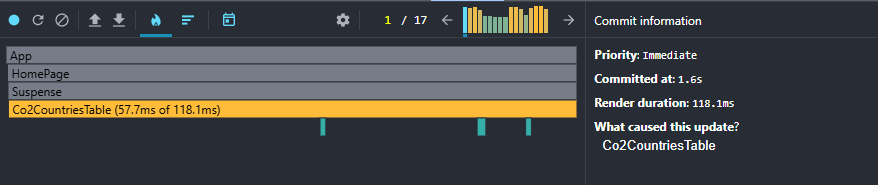
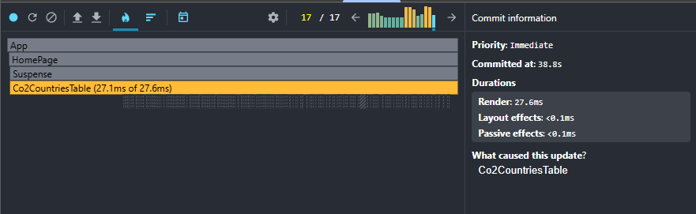

## Performance Profiling

### Before optimizations
- **Commit duration:** ~118.1ms average
- **Render duration (CountryRow):** ~57.7ms of 118.1ms
- **Interactions:** Sorting, searching, and changing year triggered a **full re-render of the entire table including all rows**, even if only a small subset of data changed.
- **Flame Graph:** Large red/yellow hot zones across `Co2CountriesTable` and every `CountryRow`, showing that **all rows were re-rendered on every interaction**.
- **Ranked Chart:** `Co2CountriesTable` and all `CountryRow` components consistently appeared at the top of the rendering cost list with high render times.

### After optimizations (React.memo, useMemo, useCallback)
- **Commit duration:** ~27.6ms average
- **Render duration (CountryRow):** ~27.1ms of 27.6ms
- **Interactions:** Sorting now updates only table headers and row order, year changes highlight only updated cells, and search filters rows without re-rendering unaffected components.
- **Flame Graph:** Most components remain gray (inactive). Only updated `CountryRow` instances appear as hot spots, indicating **partial re-rendering instead of full table refresh**.
- **Ranked Chart:** Only updated rows and the table header appear in the rendering cost list. Global recalculations and unnecessary re-renders were eliminated.

### Conclusion
After applying `React.memo`, `useMemo`, and `useCallback`, rendering performance improved by ~2.5–3x:
- Reduced commit duration.
- Eliminated unnecessary re-renders of unchanged components.
- Made interactions (sorting, searching, year change) smoother and more responsive.